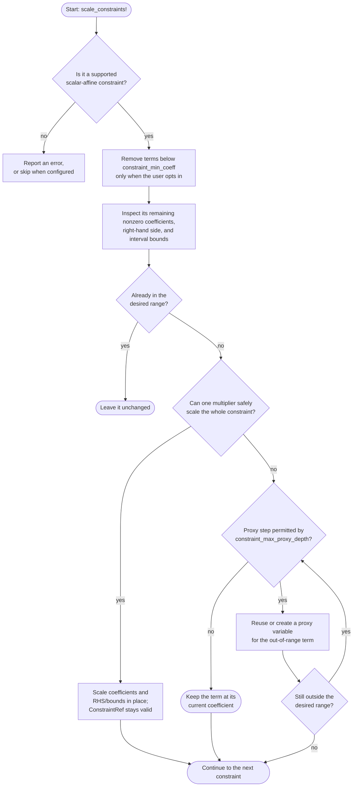
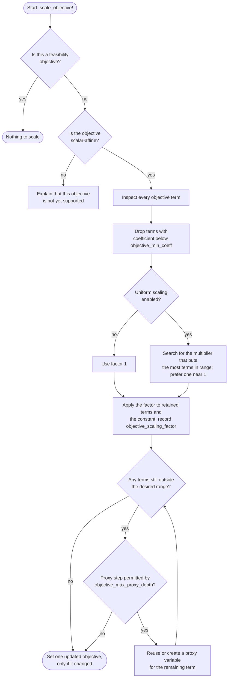

# MacroEnergyScaling.jl

A package to rescale and improve the numerical stability of JuMP-based optimization models

## Instructions

This package rescales scalar-affine JuMP constraints and objectives. To rescale constraints, call `scale_constraints!(EP)` with your model `EP`. To rescale a scalar-affine objective, call `scale_objective!(EP)`. The package improves numerical stability while preserving the objective value by default. It supports JuMP caching models and direct models when the optimizer supports the required incremental modifications.

The user can adjust the manner in which the model is rescaled by creating a `ScalingSettings` object and passing it to `scale_constraints!(EP, settings)` or `scale_objective!(EP, settings)`. The `ScalingSettings` object can be created by providing the preferred settings in a dictionary.

Some constraints will be rescaled using proxy variables, where a new variable will be created which is a multiple of the original variable. This adds additional constraints to the model. Existing constraints are updated in place, so their `ConstraintRef`s remain valid.

Set `constraint_min_coeff` to deliberately remove constraint terms whose original coefficient magnitude is smaller than that value before scaling. Its default is `0.0`, so constraint scaling preserves every nonzero term by default. As with `objective_min_coeff`, a positive value is an approximation and can change the model's feasible region.

To avoid creating unnecessary proxies, the package can reuse a proxy whose multiplier is close to the requested multiplier. `proxy_multiplier_reuse_ratio` controls this tolerance: its default of `10.0` permits reuse within a factor of ten. A larger value creates fewer proxies but uses less tailored scaling.

`constraint_max_proxy_depth` and `objective_max_proxy_depth` independently limit proxy substitutions for constraint and objective terms. Both default to `-1` for unlimited recursion; `0` disables proxy substitutions, and a positive value permits that many proxy steps. When a limit is reached, the term is retained at its current coefficient, even if it remains outside the requested range.

For a fully scaled model, call `scale_objective!` before `scale_constraints!` with the same `ScalingSettings` object. Objective coefficients with magnitude below `objective_min_coeff` are dropped before scaling; its default is `0.0`, so objective scaling preserves the objective exactly by default. Set `scale_objective_uniformly = true` to first apply a uniform multiplier that reduces proxy use. This scales solver-reported objective values and constraint duals; recover an unscaled objective value with `objective_value(model) / settings.objective_scaling_factor`. The factor accumulates across calls using the same settings object for one objective workflow, and cannot restore terms removed by `objective_min_coeff`.

## How scaling works

Solvers are generally happiest when the numbers in a model are neither extremely small nor extremely large. MacroEnergyScaling first looks through the nonzero coefficients, compares their absolute sizes with the ranges in `ScalingSettings`, and changes only the terms that need help. A proxy variable is a bookkeeping variable linked to the original variable by an equality; it lets the package rescale one troublesome term without changing the mathematical meaning of the model.

### Constraint scaling

Scaling a constraint happens in place, so code that holds its `ConstraintRef` can keep using that reference. For a wide interval whose two bounds need incompatible multipliers, the package reports the offending constraint by default; set `scale_wideintervals = false` to leave it alone.

### Objective scaling

With the default `objective_min_coeff = 0.0` and uniform scaling disabled, objective scaling preserves both the selected solution and the reported objective value exactly. A positive minimum deliberately approximates the objective by dropping tiny terms. Uniform scaling is opt-in because it changes the solver-reported objective value and constraint duals, even though it preserves the optimizer's preferred solution. Recover the original objective value with `objective_value(model) / settings.objective_scaling_factor`.

Note, this package does not reformulate the model, it only rescales it. Better performance and numerical stability can be achieved by reformulating the model. This can achieve the same re-scaled coefficients and right-hand sides but without the need for proxy variables and additional constraints.

Currently, MacroEnergyScaling supports scalar-affine `<=`, `>=`, `==`, and non-wide two-sided interval constraints. By default, it errors for a wide interval whose lower and upper bounds require different scaling multipliers. Set `scale_wideintervals = false` in `ScalingSettings` to skip wide intervals, or break them into two one-sided constraints. It also errors by default if the model contains other constraint types; set `scale_nonaffine = false` to skip them. Constraints are processed in JuMP's constraint-type order; when proxy variables are used, this can affect which proxies are reused and therefore the auxiliary formulation, without changing the feasible region.
